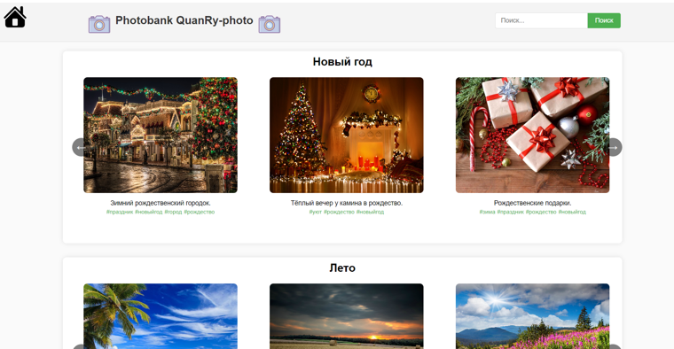
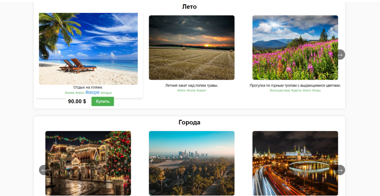
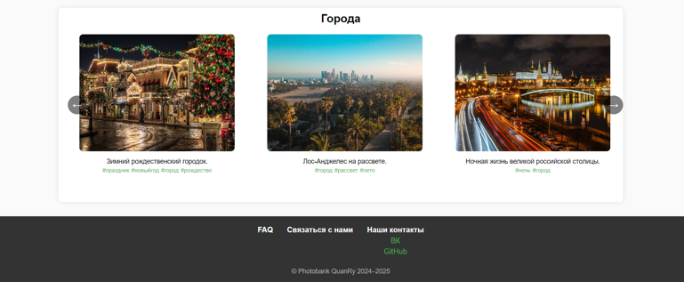
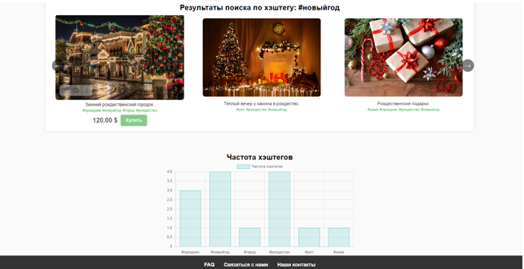
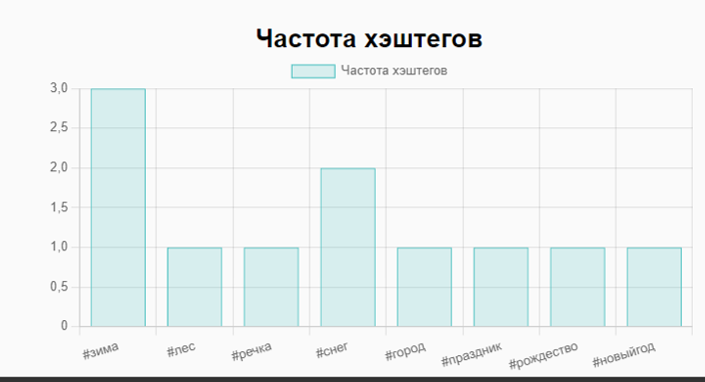
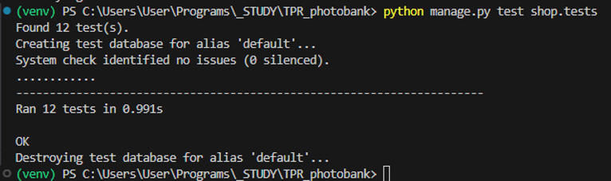

## Веб-приложение "Фотобанк с поиском данных по нему"
---

### О разработке 

##### Эта разработка веб-приложения посвящена созданию серверной части приложения для управления фотобанком и реализации функционала поиска по хэштегу, названию и другим данным изображения. Основная задача проекта заключается в разработке приложения с применением Python и фреймворка Django для работы с данными о фотографиях, их категориях, тегах и информации о загрузке. Для хранения данных выбрана база данных PostgreSQL 17.
---

### Описание веб-приложения:

На главной странице сайта расположен перечень из картинок / фотографий / изображений, отобранных по критериям, объединенных в группы.

  
  
 Рисунок 1 – Главная страница сайта 
 

В верхней части страницы находится хедер, который включает в себя логотип сайта с возможностью перехода на главную страницу. 
В центре хедера отображается название сайта с дополнительными логотипами по бокам.

  
  
 Рисунок 2 – Главная страница сайта (хедер) 
 

После хедера на странице идут секции с изображениями, отобранными по категориям: «Новый год», «Лето», «Города» и т.д.
Каждая категория отображает фотографии, отфильтрованные по соответствующим критериям. Фотографии отображаются в виде слайдера, где можно пролистывать изображения с помощью кнопок влево и вправо.
Для каждой фотографии отображаются метаданные, такие как описание, хэштеги, цена и кнопка для покупки.

  
  
 Рисунок 3 – Главная страница сайта (отображение хэштегов и стоимости) 
 

В футере размещена информация о сайте, включая разделы с часто задаваемыми вопросами (FAQ) и контактами.

  
  
 Рисунок 4 – Главная страница сайта (футер) 
 

В хедере предусмотрено поле для ввода поискового запроса, где пользователь может ввести хэштег или ключевое слово. При нажатии на кнопку «Поиск» данные из поля ввода передаются в URL как параметр, и происходит переход на страницу поиска, где отображаются фотографии, связанные с введенным хэштегом.

  
  
 Рисунок 5 – Страница поиска и фильтрации (результаты поиска) 
 

Чтобы после поиска пользователь смог увидеть распределение хэштегов по картинкам мы выводим график распределения этих хэштегов в количественном отношении.

  
  
 Рисунок 6 – Гистограмма с помощью библиотеки Pandas (на странице поиска и фильтрации) 
 

В процессе разработки веб-приложения на Django важно обеспечивать стабильность и корректную работу всех его компонентов, особенно при внесении изменений в код. Для этого был разработан набор автотестов, который позволяет автоматизировать проверку функциональности и убедиться, что изменения не влияют на ключевую логику работы сайта.

В результате была написана серия из 12 автотестов, которые успешно прошли все этапы выполнения и подтвердили, что внесенные изменения не повлияли на функциональность приложения. Результаты выполнения тестов представлены на рисунке 7.

  
  
 Рисунок 7 – Результаты автотестирования  
 

---
### Выводы:
В рамках данной курсовой работы было разработано Django веб-приложение на языке Python, использующее архитектурный паттерн MVC, а также различные паттерны проектирования GoF. Приложение включает модульные тесты, процесс рефакторинга и базу данных, которая заполняется с помощью генератора данных. 
